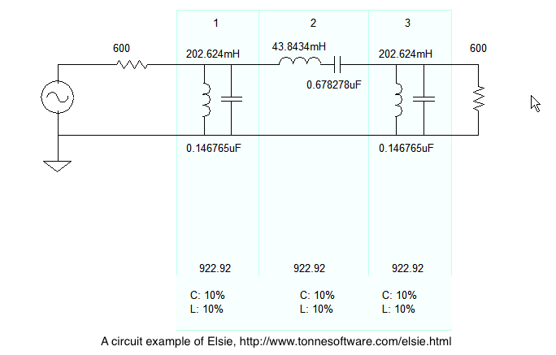
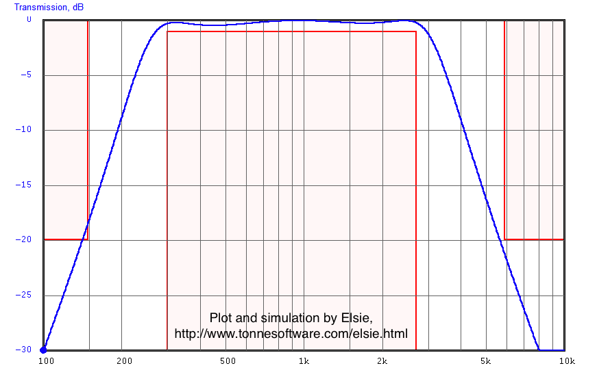
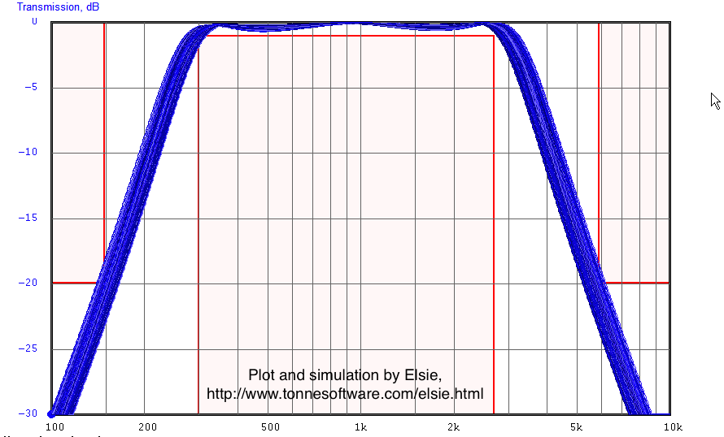
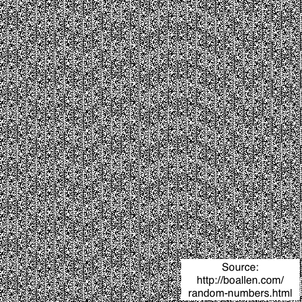
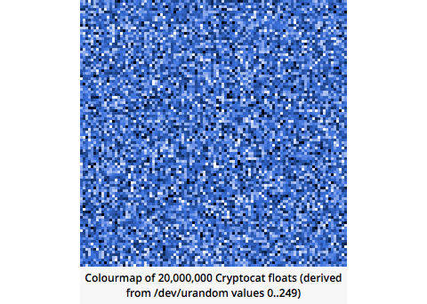
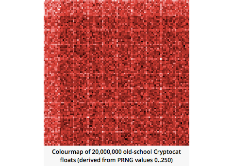

footer: Kenji Rikitake / Erlang Factory SF Bay 2015
slidenumbers: true

# Xorshift* and Erlang/OTP: Searching for Better PRNGs

<!-- Use Deckset 1.4, Next theme, 4:3 aspect ratio -->

---

## Kenji Rikitake

27-MAR-2015
Erlang Factory SF Bay 2015
San Francisco, CA, USA
@jj1bdx

Professional Internet Engineer

ACM Erlang Workshop 2011 Workshop Chair

Erlang Factory SF Bay 2010-2015 speaker (for *six* consecutive years!)


---

# Executive summary: do not try inventing your own random number generators!

---

# PRNGs matter

* The first talk of pseudo random number generators in Erlang Factory events was on 2011
* Now four years later, people are *still using* the good-old `random` module, already *fully exploited*. **We should stop using it!**
* So I decided to do the talk again with new algorithms, and the talk is accepted

---

# PRNGs are everywhere

* Rolling dice (for games)
* (Property) testing (QuickCheck, ProPer, Triq)
* Variation analysis of electronic circuits
* Network congestion and delay analysis
* Risk analysis of project schedules
* Passwords (*Secure PRNGs* only!)
* Generating noise

---

# Variation analysis of a band pass filter



---

# Without variance



---

# With 10% variance



---

# How PRNG works

* Sequential iterative process
* For multiple processes, seeds and other parameters should be chosen carefully to prevent sequence overlapping

```erlang
% Give a seed S1
{Result1, S2} = prng(S1),
{Result2, S3} = prng(S2),
% ... and on and on
```

---

# NOT in this talk: Secure PRNGs

* For password and cryptographic key generation with strong security
* Use `crypto:strong_rand_bytes/1`
* Remember entropy gathering takes time
* This is *cryptography* - use and *only use* proven algorithms! *Do not invent yours!*

---

# In this talk: non-secure PRNGs

* May be *vulnerable to cryptographic attacks*
* (Uniform) distribution guaranteed
* *Predictive*: same seed = same result
* Lots of seed (internal state) choices
* Long period: no intelligible patterns

---

# Even non-secure PRNGs fail

* Found from the observable patterns by making a graphical representation
* *Very short period* of showing up the same number sequence again
* Even a fairly long sequence of numbers can be *fully exploited* and made predictable

---

# PHP5 on Windows (2012)



---

# Other PRNG failures

* [Cryptocat 2013](https://nakedsecurity.sophos.com/2013/07/09/anatomy-of-a-pseudorandom-number-generator-visualising-cryptocats-buggy-prng/) (blue: OK, red: bad)

 

---

# Erlang/OTP's first ever security advisory

* ... was about PRNG! (R14B02, 2011)
* [US CERT VU#178990](http://www.kb.cert.org/vuls/id/178990): Erlang/OTP SSH library uses a weak random number generator ([CVE-2011-0766](http://www.cvedetails.com/cve/CVE-2011-0766/))
* Used `random` non-secure PRNG for the SSH session RNG seed, easily exploitable

---

# Erlang `random`'s problem

* The algorithm AS183 is too old (designed in 1980s for 16-bit computers)
* Period: 6953607871644 ~= 2^(42.661), too short for modern computer exploits
* Fully exploited in < 9 hours on Core i5 (single core) ([my C source](https://github.com/jj1bdx/as183-c)) - Richard O'Keefe told me this was *nothing new in either academic and engineering perspectives* (he is right!)

---

# Alternative Erlang PRNGs

* [sfmt-erlang](https://github.com/jj1bdx/sfmt-erlang) ([SFMT](http://www.math.sci.hiroshima-u.ac.jp/~m-mat/MT/SFMT/), 2^19937-1, 32-bit)
* [tinymt-erlang](https://github.com/jj1bdx/tinymt-erlang) ([TinyMT](http://www.math.sci.hiroshima-u.ac.jp/~m-mat/MT/TINYMT/index.html), 2^127-1, ~2^56 orthogonal sequences, 32-bit)
* [exs64](https://github.com/jj1bdx/exs64) ([XorShift*64](http://xorshift.di.unimi.it/), 2^64-1, 64-bit)
* [exsplus](https://github.com/jj1bdx/exsplus) ([Xorshift+128](http://xorshift.di.unimi.it/), 2^128-1, 64-bit)
* [exs1024](https://github.com/jj1bdx/exs1024) ([Xorshift*1024](http://xorshift.di.unimi.it/), 2^1024-1, 64-bit)

---

# SFMT

* Mersenne Twister: default PRNG on Python, MATLAB, C++11, R, etc.
* Internal state: 624 32-bit integers (2496 bytes)
* SIMD-oriented Fast Mersenne Twister (SFMT) = MT improved
* Extremely long period (2^19937-1, longer variants available)
* On Erlang: NIF and non-NIF versions available

---

# sfmt-erlang: on NIFs

sfmt-erlang gains a lot by NIFs because:

* It needs bulk state initialization (624 x 32-bit)
* NIFnizing it makes total execution time ~16 times faster (on FreeBSD, OTP 17.4.1)
* Execution time of state initialization: ~100 times faster (~1600 -> ~15 microseconds)

^ Reductions: 1569 -> 4 (`process_info/2`)
^ FreeBSD 10.1-STABLE, Core i5-3427U (2.3GHz, 8 HTs), Erlang/OTP 17.4.1, clang

---

# TinyMT

* Tiny Mersenne Twister for restricted resources
* Shorter but sufficient period (2^127-1)
* 127-bit state + three 32-bit words for the polynomial parameters
* ~2^56 choice of orthogonal polynomials, suitable for parallelism
* On Erlang: non-NIF only

---

# tinymt-erlang: on NIFs

tinymt-erlang did not gain much from NIFs presumably because:

* No bulk initialization, state calculation complexity is small
* Most of execution time: function calling overhead
* In NIFs, sfmt-erlang was *faster* for generating a large sequence

---

# So are NIFs effective?

* Not really, unless processing a bulk generation/computation
* Remember NIFs *block* the scheduler
* If NIFs are not needed, don't use them
* If NIFs are really needed, tuning the scheduler is *inevitable* - ask the gurus for the details

---

# Xorshift*/+ algorithms

* Marsaglia's [Xorshift](http://www.jstatsoft.org/v08/i14/), output scrambled by [the algorithm of Sebastiano Vigna](http://xorshift.di.unimi.it/) for the best result against [TestU01](http://www.iro.umontreal.ca/~simardr/testu01/tu01.html) strength test
* Xorshift64\*, Xorshift128+, Xorshift1024\* are so far the most practical three choices
* C code in public domain
* Deceptively simple

---

# Xorshift64*

```erlang
% See https://github.com/jj1bdx/exs64
-type uint64() :: 0..16#ffffffffffffffff.
-opaque state() :: uint64().
-define(UINT64MASK, 16#ffffffffffffffff).
-spec next(state()) -> {uint64(), state()}.
next(R) ->
    R1 = R bxor (R bsr 12),
    R2 = R1 bxor ((R1 bsl 25) band ?UINT64MASK),
    R3 = R2 bxor (R2 bsr 27),
    {(R3 * 2685821657736338717) band ?UINT64MASK, R3}.
```

---

# Xorshift1024* (1/2)

```erlang
% See https://github.com/jj1bdx/exs1024
-type uint64() :: 0..16#ffffffffffffffff.
-opaque seedval() :: list(uint64()). % 16 64-bit integers
-opaque state() :: {list(uint64()), list(uint64())}.
-define(UINT64MASK, 16#ffffffffffffffff).
%% calc(S0, S1) -> {X, NS1} / X: random number output
-spec calc(uint64(), uint64()) -> {uint64(), uint64()}.
calc(S0, S1) ->
    S11 = S1 bxor ((S1 bsl 31) band ?UINT64MASK),
    S12 = S11 bxor (S11 bsr 11),
    S01 = S0 bxor (S0 bsr 30),
    NS1 = S01 bxor S12,
    {(NS1 * 1181783497276652981) band ?UINT64MASK, NS1}.
```

---

# Xorshift1024* (2/2)

```erlang
-spec next(state()) -> {uint64(), state()}.
% with a ring buffer using a pair of lists
next({[H], RL}) ->
    next({[H|lists:reverse(RL)], []});
next({L, RL}) ->
    [S0|L2] = L,
    [S1|L3] = L2,
    {X, NS1} = calc(S0, S1),
    {X, {[NS1|L3], [S0|RL]}}.
```

---

# Performance implications

* HiPE highly recommended
* Handling full 64-bit numbers means handling BIGNUMs and slow; short integers are up to (2^59)
* `exs64`: < x2 execution time of `random`
* `exs1024`: slower, but ~ x2 of `random`
* Speed penalty: worth being paid for

---

# Suggested purposes for the alternative PRNGs

* sfmt-erlang: proven, can be chosen in [ProPer](http://proper.softlab.ntua.gr/)
* tinymt-erlang: proven, has ~268 million polynomial parameters available at [tinymtdc-longbatch](https://github.com/jj1bdx/tinymtdc-longbatch)
* exs64: replacement of AS183
* exsplus: an alternative to exs64
* exs1024: good choice for simulation

---

# Merging to OTP (1/2)

* Dan Gudmundsson (of OTP Team) offered me to help writing a multi-algorithm successor of `random` module
* exs64/plus/1024: MIT licensed (by me)
* sfmt-erlang/tinymt-erlang: BSD licensed
* All pieces of code had to be relicensed in *Erlang Public License* to be included in OTP

---

# Merging to OTP (2/2)

* It was expected to be called as new `random`, but the OTP team didn't want it (presumably due to backward compatibility issues), so it's called `rand`
* Project name: [emprng](https://github.com/jj1bdx/emprng)
* `random`-compatible functions currently available for the six algorithms: as183, exs64 (default), exsplus, exs1024, sfmt, tinymt

---

# Future directions

* Keep promoting banning/deprecating the good-old `random` module and use *something else that is much better* (try [exs64](https://github.com/jj1bdx/exs64))
* Merge emprng to OTP: more algorithms, user-supplied functions, tests
* Analyze performance implication on large-scale applications

---

# Thanks<br><br>Questions?
