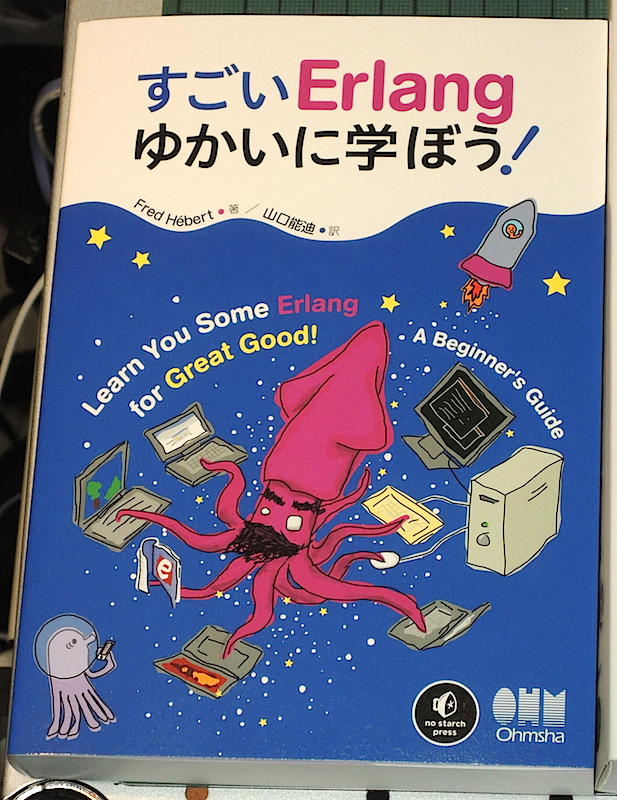
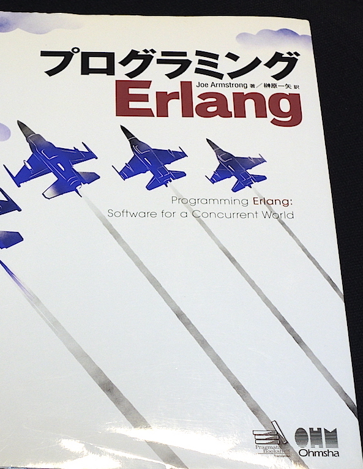

footer: Kenji Rikitake / Erlounge SF 26-MAR-2015
slidenumbers: true

<!-- Use Deckset 1.4, Next theme, 4:3 aspect ratio -->

# Erlang in Japan

Kenji Rikitake
@jj1bdx
26-MAR-2015
Erlounge
San Francisco, CA, USA

---

# LYSE in Japanese

* [LYSE in Japanese](http://estore.ohmsha.co.jp/titles/978427406
912P)
* [Japanese web page](http://www.ymotongpoo.com/works/lyse-ja/)

---

# Joe's book in Japanese

* [Programming Erlang 1st ed in Japanese](http://estore.ohmsha.co.jp/titles/978427406714P)
* Reference translation

---

# Japanese magazine article

* I've just started a monthly series on **Software Design** about Erlang/OTP and concurrent programming

---

# Study groups

* [Sapporo-beam](http://sapporo-beam.github.io/) (mostly Elixir activities)
* [Riak Source Code Reading @ Tokyo](http://riak-scr.connpass.com/)

And many other occasional gatherings such as:

* [Kabukiza Tech #3: Real World Erlang/OTP](http://kbkz.connpass.com/event/5288/)

---

# Notable users

* [Shiguredo](http://shiguredo.jp/): specialized in MQTT, WebRTC, and other advanced technologies
* [Dwango's case study](http://kbkz.connpass.com/event/5288/): massive video distribution system for non-PC terminals
* [VOYAGE GROUP's case study](http://www.slideshare.net/ajiyoshi/real-world-erlang): real-time bidding system
* [LeoFS](http://leo-project.net/leofs/): distributed storage
* [Basho Japan](http://basho.co.jp/), and Riak / Riak CS users

---

# Mirror site in Japan

* [erlang-users.jp](http://erlang-users.jp/): providing a mirror site of Erlang/OTP distributions in Japan

---

# Summary

* Erlang/OTP and Elixir has been gaining the popularity in Japan, slowly but surely
* More Japanese good documents and reference materials are still heavily in need (Japanese engineers have severe difficulties in reading/listening to English)

---

# Sponsored advertisement

* If you have difficulties working with Japanese IT engineers, contact **Kenji Rikitake Professional Engineer's Office!**
* Projects done: English-to-Japanese web security document translation, HTML5+CSS3+jQuery web site design
* Interested in Erlang/OTP, FreeBSD, computer security, and the Internet industry

