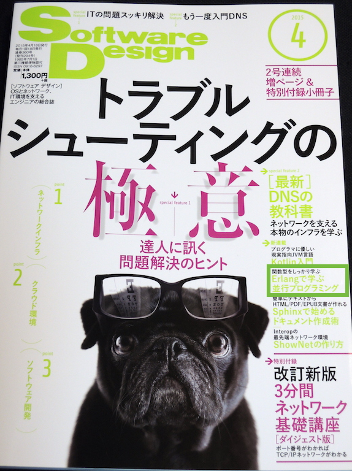

footer: Kenji Rikitake / Erlounge SF 26-MAR-2015
slidenumbers: true

<!-- Use Deckset 1.4, Next theme, 4:3 aspect ratio -->

# Erlang in Japan

Kenji Rikitake
@jj1bdx
26-MAR-2015
Erlounge
San Francisco, CA, USA

---

# Japanese books (1)

* [LYSE in Japanese](http://estore.ohmsha.co.jp/titles/978427406
912P)
* [Japanese web page](http://www.ymotongpoo.com/works/lyse-ja/)

---

# Japanese books (2)

* [Programming Erlang 1st ed in Japanese](http://estore.ohmsha.co.jp/titles/978427406714P)
* Reference translation

---

# Japanese article

* I've just started a monthly series on **Software Design**

---

# Study groups

* [Sapporo-beam](http://sapporo-beam.github.io/) (mostly Elixir activities)
* [Riak Source Code Reading @ Tokyo](http://riak-scr.connpass.com/)

And many other occasional gatherings such as:

* [Kabukiza Tech #3: Real World Erlang/OTP](http://kbkz.connpass.com/event/5288/)

---

# People

* [@voluntas](https://twitter.com/voluntas/)
* [@kuenishi](https://twitter.com/kuenishi/)
* [@ajiyoshi](https://twitter.com/ajiyoshi/)

And quite a few other people

---

# Notable users

* [Shiguredo](http://shiguredo.jp/): specialized in MQTT, WebRTC, and many others
* [Dwango's case study](http://kbkz.connpass.com/event/5288/): video distribution system for non-PC terminals
* [VOYAGE GROUP's case study](http://www.slideshare.net/ajiyoshi/real-world-erlang): real-time bidding system
* [LeoFS](http://leo-project.net/leofs/): distributed storage
* [Basho Japan](http://basho.co.jp/), and Riak / Riak CS users

---

# Mirror site in Japan

* [erlang-users.jp](http://erlang-users.jp/)

---

# Issues

* Notable people are all too busy to form or maintain large sustainable communities
* ~70% of Japanese in Tokyo/Kansai claim they only speak Japanese ([Source by Hakuhodo](http://seikatsusoken.jp/teiten2014/answer/762.html))
* Only ~1.4% of Japanese in Tokyo/Kansai claim they can negotiate complex issues in English([Source by Hakuhodo] (http://seikatsusoken.jp/teiten2014/answer/747.html))

---

# Conclusions and blatant advertisement

* Erlang/OTP and Elixir has been gaining the popularity in Japan, slowly but surely
* If you have difficulties working with Japanese IT engineers, contact me!
* Specialized in Erlang/OTP, FreeBSD, computer security, and the Internet industry
* I speak (American) English and Japanese

